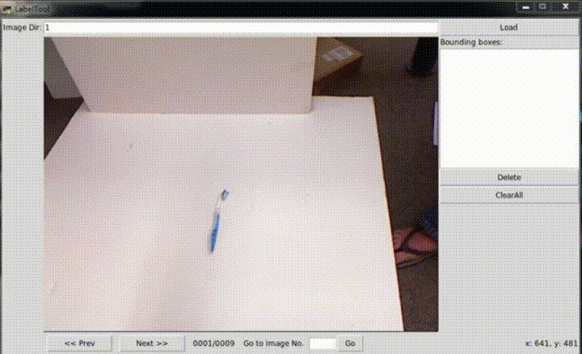

BBox\_with\_angle-Label-Tool
===============

A simple tool for labeling object bounding boxes in images, implemented with Python Tkinter.

Data Organization
-----------------
>LabelTool  
>|  
>|--main.py   *# source code for the tool*  
>|  
>|--Images/   *# direcotry containing the images to be labeled*  
>|  
>|--Labels/   *# direcotry for the labeling results*  

Dependency
----------
- python 2.7 
- PIL-1.1.7.win32-py2.7

Startup
-------
```
$ python main.py
```

Usages
------
* Input a **`[dir path]`** in **Image/**, and click 'Load'. The images will be loaded.
* To create a new bounding box, follow three steps:
	1. First, left-click to select the first vertex. Moving the mouse to draw a rectangle.
	2. Second, left-click again to select the second vertex. Moving the mouse to rotate the rectangle.
	3. Last, left-click again to fix the rectangle.
* To cancel the bounding box while drawing, just press <kbd>Esc</kbd>.
* To delete a existing bounding box, select it from the listbox, and click 'Delete' or press <kbd>Del</kbd>.
* To delete all existing bounding boxes in the image, simply click 'ClearAll'.
* After finishing one image, click 'Next' or press <kbd>PgDn</kbd> to advance. 
* Likewise, click 'Prev' or press <kbd>PgUp</kbd> to reverse. 
* Or, input the index and click 'Go' to navigate to an arbitrary image.
* The labeling result will be saved if and only if the 'Next' button is clicked.


>[Demo Video](https://youtu.be/dZGoISfAJmI)

Label Format
------------
- `BBox_num`:number of bounding box
- `xc`:rectangle center `x`
- `yc`:rectangle center `y`
- `w`:`width` of the rectangle
- `h`:`height` of the rectangle
- `theta`:`angle` of the rectangle

```
BBox_num
xc yc w h theta
.
.
.
```

Reference
---------
This original Tool is fork from [puzzledqs/BBox-Label-Tool](https://github.com/puzzledqs/BBox-Label-Tool)
